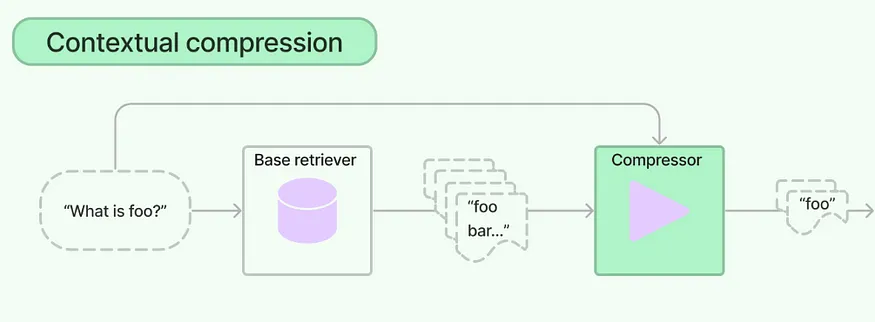

# Implement Contextual Compression And Filtering In RAG Pipeline

## Contextual Compressors and Filters

- One of the biggest problems that we can face in RAG is that what content is actually retrieved by the retrievers.

- The context retrieved is not all useful. Only very small amount in the larger chunk passed has actual information to the overall answer.

- At times there will be scenarios where a particular question would require answers or facts from multiple chunks and they need to be synthesized together.

- Also there can be scenario where we have to clarify on questions where we do not want other facts getting introduced into the context learning window along with the actual query.

## What is Contextual Compression?

- One challenge with retrieval is that we usually you do not know the specific queries our document storage system will face when you ingest data into the system.

- This means that the information most relevant to a query may be buried in a document with a lot of irrelevant text. Passing that full document through your application can lead to more expensive LLM calls and poorer responses.

- So here the idea of Contextual compression comes handy. The idea here is that :-

    - We have some kind of base retriever that retrieves a bunch of different pieces of information.
    - Then we add this information to the docuiment compressor.
    - The compressor filters and processes this information to extract only what is useful to answer the question.

- To use Contextual compressor You'll need:

    - A base retriever
    - A Document Compressor

## Steps followed in Contextual Compression

- The Contextual Compression Retriever passes queries to the base retriever.

- It then takes the initial documents and passes them through the Document Compressor.

- The Document Compressor takes a list of documents and shortens it by reducing the contents of documents or dropping documents altogether.

## Pipelines 

- Stringing compressors and document transformers together

    - embeddings: langchain_core.embeddings.Embeddings [Required] Embeddings to use for embedding document contents and queries.

    - k: Optional[int] = 20 The number of relevant documents to return. Can be set to None, in which case     similarity_threshold must be specified. Defaults to 20.
    
    - similarity_fn: Callable = Similarity function for comparing documents. Function expected to take as input two matrices (List[List[float]]) and return a matrix of scores where higher values indicate greater similarity.
    
    - similarity_threshold: Optional[float] = None Threshold for determining when two documents are similar enough to be considered redundant. Defaults to None, must be specified if k is set to None.

## Summary

- In conclusion, addressing the challenge of retrieval in document storage systems requires a thoughtful approach to enhance efficiency and responsiveness. The inherent uncertainty about specific queries during data ingestion often leads to the inclusion of irrelevant information in documents. This, in turn, can result in increased costs and suboptimal responses when utilizing large language models. The concept of Contextual Compression emerges as a valuable solution to this issue. By employing a base retriever to gather diverse information and subsequently utilizing a document compressor, the system can filter and process the data, retaining only the pertinent details necessary to respond effectively to user queries. This approach not only optimizes the use of resources but also contributes to the overall improvement of system performance and user experience.