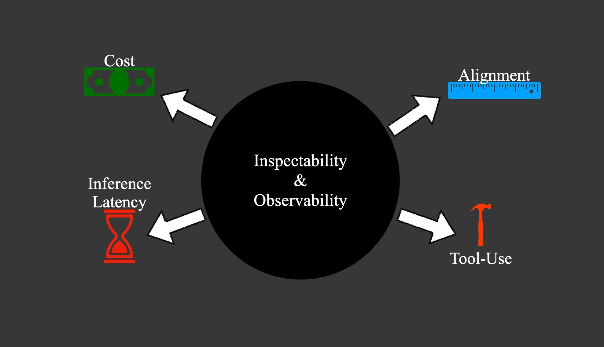
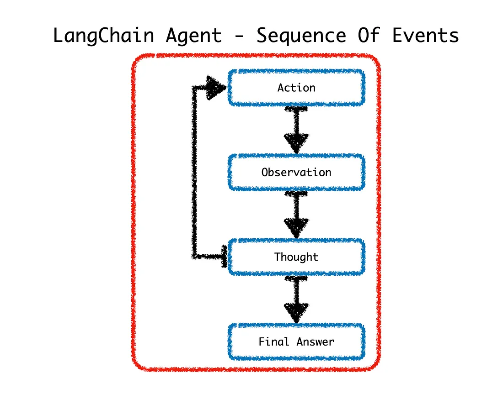

# The Langchain Ecosystem

- The current LangChain ecosystem of tools is a good indication in terms of best practice when it comes to LLM implementations.

## LangChain, LangChain-Core & LangChain-Community

- According the LangChain, the existing LangChain package is being separated into three separate packages.

### LangChain

- LangChain contains use-case specific chains, agents, and RAG code which acts as the backbone of cognitive applications.

### LangChain-Core

- Abstractions that have emerged as a standard
- LangChain Expression Language

    - *The langchain-core package contains base abstractions that the rest of the LangChain ecosystem uses, along with the LangChain Expression Language. It is automatically installed by LangChain, but can also be used separately.*

### Langchain-Community

- LangChain-Community contains all third party integrations.

- This is done to support the fast expanding LangChain-based ecosystem around LangChain Templates, LangServe, LangSmith, and other packages.

### LangServe

- Langserve Allows makers to expose Langchain applications as a RestAPI.

## Templates

- LangChain Templates serve as a reference for application examples. This data already exists to some degree in the LangChain documentation under the templates section.

- It seems like LangChain Templates lack some degree of gravitas in terms of content and activity. Especially compared to the LangSmith hub, where critical mass is being achieved. Considering the number of prompts added in terms of the number of likes, views, downloads, etc.

- Templates has a form to request a template; templates is also a good place where integrations are featured. Each template has a link through to a Github page, which makes the templates very actionable.

- Also, templates are a great avenue to get a working example going and from there iterate on to create an implementation envisioned.

## LangSmith

- With seamless integration with LangChain, arguably the leading open source framework for building with LLMs, LangSmith enables makers to manage & monitor LLM calls from chains and intelligent agents.

- A key component for successfully implementing an application which is underpinned by one or more LLMs is inspectability & observability.

- Key elements which makers would want to observe and inspect are cost, inference latency, alignment and tool-use in the case of autonomous agents.

- LangSmith is constituted by six components:

- *Monitoring, Evaluation, Annotation, Feedback, Testing & Debugging.*

- These components close the loop in terms of evaluating applications, annotating data, getting user feedback and testing.

- An advantage of the prompt playground is access to a whole host of LLMs and also a whole host of prompts via the prompt engineering hub.

- LangSmith lets you debug, test, evaluate, and monitor chains and intelligent agents built on any LLM framework and seamlessly integrates with LangChain, the go-to open source framework for building with LLMs.

## Agents

- Agents maintain a level of autonomy by involving an LLM in order to determine which sequence of actions to follow.

- Considering the diagram below, upon receiving a request, Agents leverage LLMs to make a decision on which Action to take. After an Action is completed, the Agent enters the Observation step. From Observation step Agent shares a Thought; if a final answer is not reached, the Agent cycles back to another Action in order to move closer to a Final Answer.

