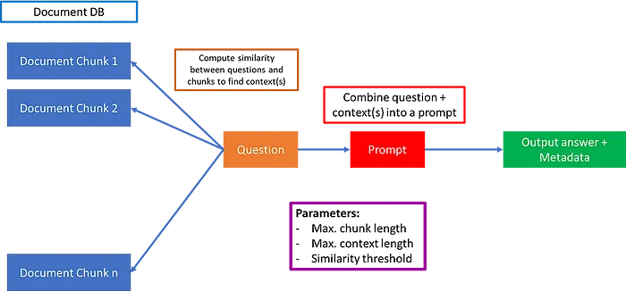
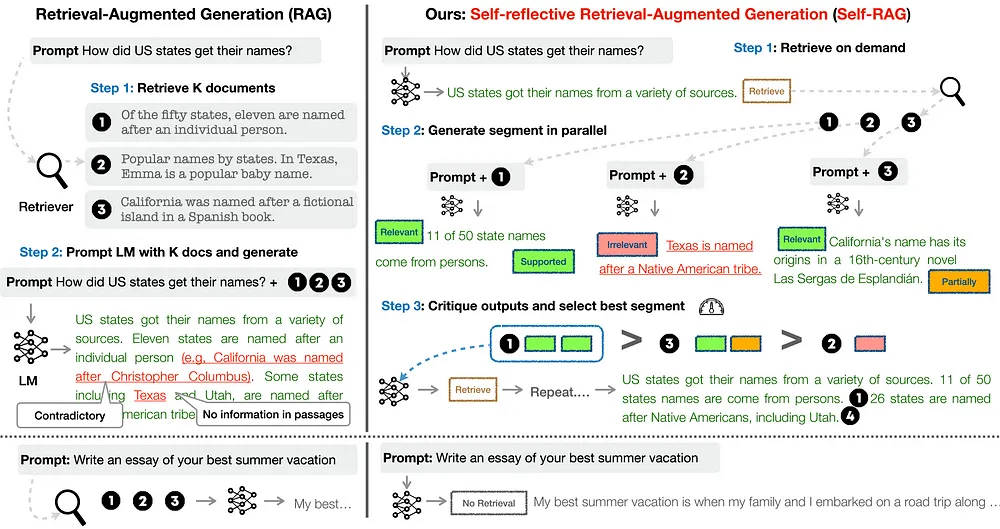
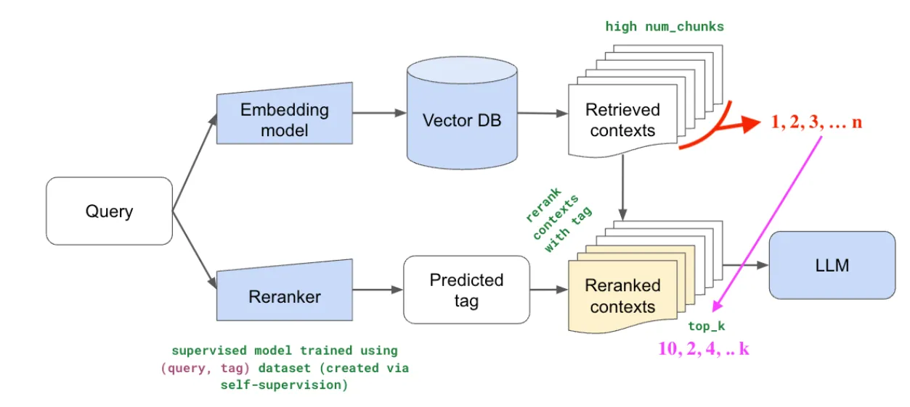

# Innovations In Retrieval Augmented Generation

- Large language models (LLMs) are all set to revolutionize the financial sector. One use-case are LLMs to pore over troves of documents and find trends in a fraction of time and at a fraction of the cost of analysts. But here’s the catch — the answers you get are only partial and incomplete many times. Take, for example, the case where you have a document containing company X’s annual revenue over the past 15 years, but in different sections. In the standard Retrieval Augmented Generation (RAG) architecture as pictured below, you typically retrieve the top-k documents, or choose documents within a fixed context length.



- However, this can have several issues. One issue is wherein the top-k documents do not contain all the answers — maybe for example only corresponding to the last 5 or 10 years. The other issue is that computing similarity between document chunks and prompt does not always yield relevant contexts. In this case, you could be getting a wrong answer.

- A real issue is that you have developed your vanilla RAG app that works well in simple cases you test out — but this fails when you present this prototype to stakeholders and they ask some out of the box questions.

1. **Self-RAG**

- The authors develop a clever way for a fine-tuned LM (Llama2–7B and 13B) to output special tokens Retrieval /No Retrieval, Relevant / Irrelevant, No support / Contradictory, Partially supported, Utility, etc. appended to LM generations to decide whether or not a context is relevant/irrelevant, the LM generated text from the context is supported or not, and the utility of the generation.



## Training Self-RAG

- Self-RAG was trained in a 2-step hierarchical process. In step 1, a simple LM was trained to classify a generated output (either just the prompt or prompt + RAG augmented output) and append the relevant special token at the end. This “critic model” was trained by GPT-4 annotations. Specifically, GPT-4 was prompted using a type-specific instruction (“Given an instruction, make a judgment on whether finding some external documents from the web helps to generate a better response.”)

- In step 2, the generator model model, using a standard next token prediction objective, learns to generate continuations, as well as special tokens to retrieve/critique generations. Unlike other fine-tuning or RLHF methods where downstream training can impact model outputs and make future generations biased, through this simple approach, the model is trained only to generate special tokens as appropriate, and otherwise not change the underlying LM!

## Evaluating Self-RAG

- The authors performed a bunch of evaluations against public health fact verification, multiple-choice reasoning, Q&A, etc. There were 3 types of tasks. Closed-set tasks included fact verification and multiple-choice reasoning, and accuracy was used as the evaluation metric. Short-form generation tasks included open-domain Q&A datasets. The authors evaluated for whether or not gold answers are included in the model generations instead of strictly requiring exact matching.

- Long-form generation included biography generation and long-form QA. For evaluating these tasks, the authors used FactScore to evaluate biographies — basically a measure of the various pieces of information generated, and their factual correctness. For long-form QA, citation precision and recall were used.

- Self-RAG has several advantages over the vanilla LLM.

    1. Adaptive Passage Retrieval: By this, the LLM can keep retrieving context until all the relevant context is found (within the context window of course.)

    2. More relevant retrieval: A lot of times, embedding models are not the best at retrieving relevant context. Self-RAG potentially solves this with the relevant/irrelevant special token.

    3. Beats other similar models: Self-RAG beats other similar models, and also surprisingly beats ChatGPT in many tasks. It would be interesting to do a comparison with data that ChatGPT has not been trained on — so more proprietary, industrial data.

    4. Doesn’t change underlying LM: For me this is a huge upsell — as we know how fine-tuning and RLHF can lead to biased models very easily. Self-RAG seems to solve this by adding special tokens, and otherwise keeping text generation the same.

2. **Re-Ranking Models**



- Re-ranking is a simple (yet powerful) idea, compared to other RAG innovations. The idea is that you retrieve a large number of documents (say n=25) first. Next, you train a smaller reranker model to select the top k (say 3) documents out of the 25, and feed that as the LLM context. This is a pretty cool technique, and conceptually makes a lot of sense — since the underlying embedding model to obtain the top-k contexts is not trained on knowledge retrieval per say, so it makes a lot of sense to train a smaller re-ranker model for specific RAG scenarios.

## Forward-Looking Active Retrieval Augmented Generation (FLARE)

- FLARE is used to handle cases where you want answers to be correct, and up to date — for which it makes sense to augment LLM knowledge with a real-time updated knowledge hub (the Internet)

- In this workflow, first the user asks a question, and the LLM generates an initial partial sentence. This partial generation acts as a seed for an Internet search query. The result from this query is then integrated into the LLM response, and this process of continuous search and update continues, until the end of the generation.

## System 2 Attention (S2A)

- S2A tries to solve the problem of spurious context with a little more finesse. Instead of marking contexts as relevant/irrelvant as in self-RAG or re-ranking, in S2A context is regenerated to remove noise and ensuring relevant information remains.

- S2A works through a specific instruction that requires the LLM to regenerate the context, extracting the part that is beneficial for providing relevant context for a given query.

- Overall, S2A has a ~15% higher accuracy than traditional RAG implementations from multiple evaluations.

```md

## Sample Prompt

- Given the following Text by the user, extract the part that is unbiased and not their opinion, so that using that text alone would be good context for providing an unbiased answer to the question portion of the text.

Please include the actual question or query that the user is asking. Seperate this in two categories labelled with "Unbiased Text context (Includes all content except user's bias): " and "Question/ Query (does not include user bias or performance):"

Text by User : [ORIGINAL INPUT PROMPT]

```

## MultiModal Prompt

- Multimodal RAG that can search across disparate types of data — text, vision, audio, etc.

- It can generate simultaneous embeddings for both image and text. The embeddings can be used to extract the top-k contexts (image+text) that are most similar to the question. The next step is to combine these contexts and input and feed into a multimodal model like GPT-V or LLaVa to synthesize the final response.