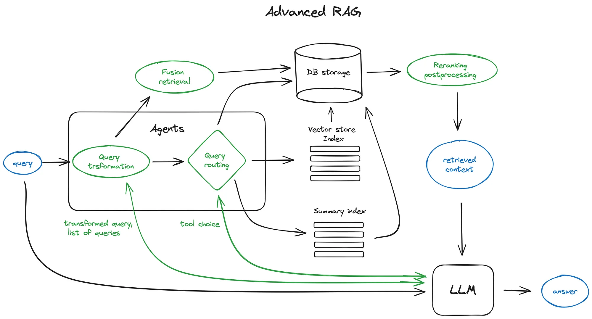
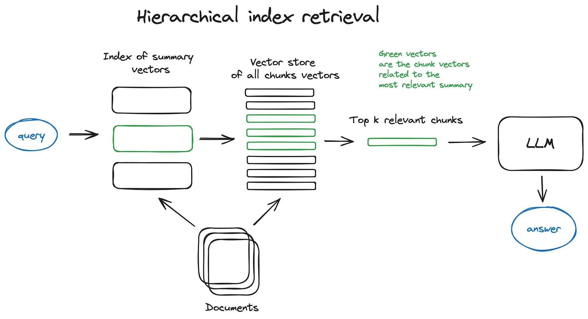
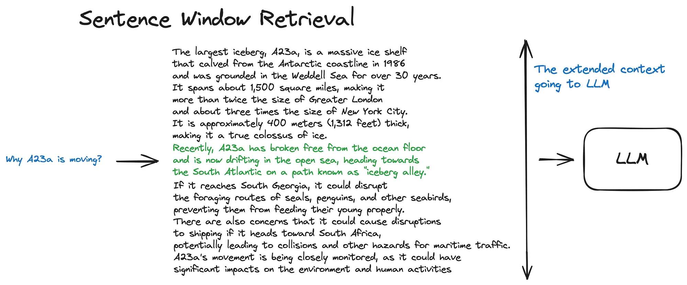
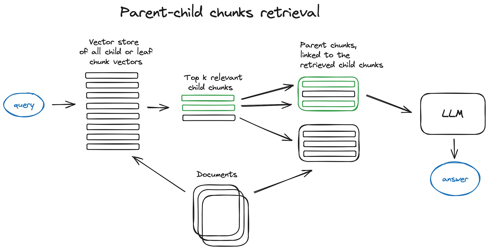
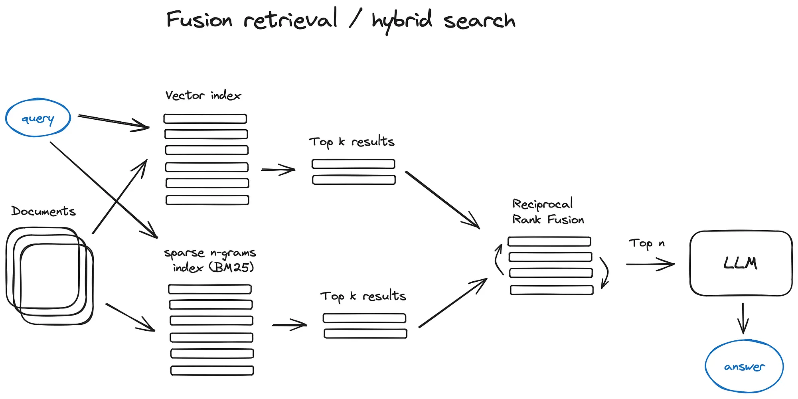
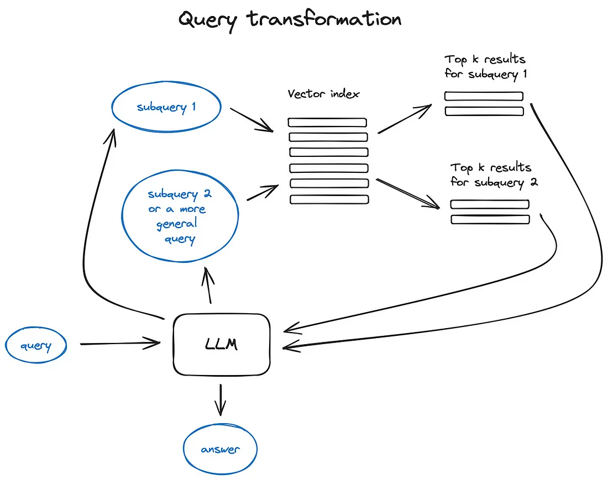
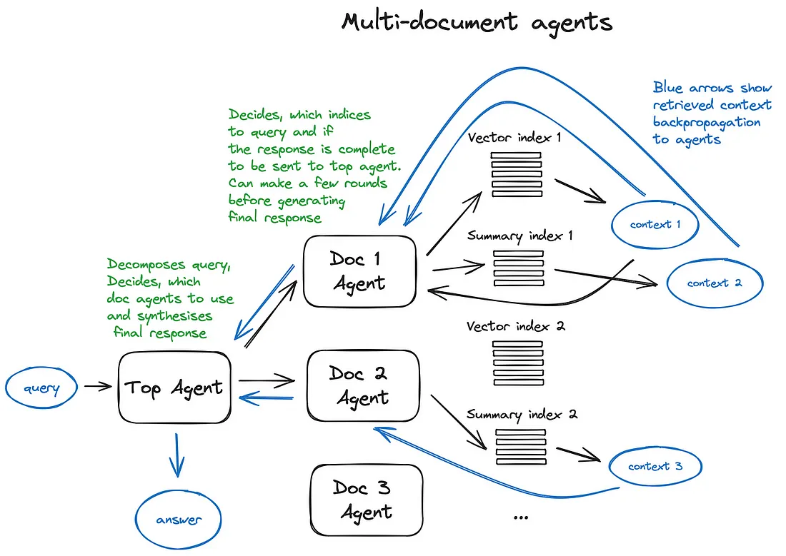

# Advanced RAG Techniques

## Naive RAG

- In brief looks the following way: you split your texts into chunks, then you embed these chunks into vectors with some Transformer Encoder model, you put all those vectors into an index and finally you create a prompt for an LLM that tells the model to answers user’s query given the context we found on the search step.
In the runtime we vectorise user’s query with the same Encoder model and then execute search of this query vector against the index, find the top-k results, retrieve the corresponding text chunks from our database and feed them into the LLM prompt as context.

## Advanced RAG

1. Chunking and Vectorization 

- First of all we want to create an index of vectors, representing our document contents and then in the runtime to search for the least cosine distance between all these vectors and the query vector which corresponds to the closest semantic meaning.

## Chunking

- Transformer models have fixed input sequence length and even if the input context window is large, the vector of a sentence or a few better represents their semantic meaning than a vector averaged over a few pages of text (depends on the model too, but true in general), so chunk your data — split the initial documents in chunks of some size without loosing their meaning (splitting your text in sentences or in paragraphs, not cutting a single sentence in two parts). There are various text splitter implementations capable of this task.

- The size of the chunk is a parameter to think of — it depends on the embedding model you use and its capacity in tokens, standard transformer Encoder models like BERT-based Sentence Transformers take 512 tokens at most, OpenAI ada-002 is capable of handling longer sequences like 8191 tokens, but the compromise here is enough context for the LLM to reason upon vs specific enough text embedding in order to efficiently execute search upon.

## Vectorization

- The crucial part of the RAG pipeline is the search index, storing your vectorised content. The most naive implementation uses a flat index — a brute force distance calculation between the query vector and all the chunks’ vectors.

- A proper search index, optimised for efficient retrieval on 10000+ elements scales is a vector index.

2. Hierarchical Indices

- In case you have many documents to retrieve from, you need to be able to efficiently search inside them, find relevant information and synthesise it in a single answer with references to the sources. An efficient way to do that in case of a large database is to create two indices — one composed of summaries and the other one composed of document chunks, and to search in two steps, first filtering out the relevant docs by summaries and then searching just inside this relevant group.

3. Hypothetical Questions and HyDE

- Another approach is to ask an LLM to generate a question for each chunk and embed these questions in vectors, at runtime performing query search against this index of question vectors (replacing chunks vectors with questions vectors in our index) and then after retrieval route to original text chunks and send them as the context for the LLM to get an answer.

- *This approach improves search quality due to a higher semantic similarity between query and hypothetical question compared to what we’d have for an actual chunk.*

- There is also the reversed logic apporach called HyDE — you ask an LLM to generate a hypothetical response given the query and then use its vector along with the query vector to enhance search quality.

## Context Enrichment

- The concept here is to retrieve smaller chunks for better search quality, but add up surrounding context for LLM to reason upon.

- There are two options — to expand context by sentences around the smaller retrieved chunk or to split documents recursively into a number of larger parent chunks, containing smaller child chunks.

### Sentence Window Retrieval

- In this scheme each sentence in a document is embedded separately which provides great accuracy of the query to context cosine distance search.
In order to better reason upon the found context after fetching the most relevant single sentence we extend the context window by k sentences before and after the retrieved sentence and then send this extended context to LLM.

- The green part is the sentence embedding found while search in index, and the whole black + green paragraph is fed to the LLM to enlarge its context while reasoning upon the provided query

### Parent Document Retriever

- The idea here is pretty much similar to Sentence Window Retriever — to search for more granular pieces of information and then to extend the context window before feeding said context to an LLM for reasoning. Documents are split into smaller child chunks referring to larger parent chunks.

- Fetch smaller chunks during retrieval first, then if more than n chunks in top k retrieved chunks are linked to the same parent node (larger chunk), we replace the context fed to the LLM by this parent node — works like auto merging a few retrieved chunks into a larger parent chunk, hence the method name. Just to note — search is performed just within the child nodes index.

### Fusion Retrieval OR Hybrid Search

- A relatively old idea that you could take the best from both worlds — keyword-based old school search — sparse retrieval algorithms like tf-idf or search industry standard BM25 — and modern semantic or vector search and combine it in one retrieval result.

- The only trick here is to properly combine the retrieved results with different similarity scores — this problem is usually solved with the help of the Reciprocal Rank Fusion algorithm, reranking the retrieved results for the final output.

- Hybrid or fusion search usually provides better retrieval results as two complementary search algorithms are combined, taking into account both semantic similarity and keyword matching between the query and the stored documents.

4. Re-Ranking and Filtering 

- So we got our retrieval results with any of the algorithms described above, now it is time to refine them through filtering, re-ranking or some transformation. In LlamaIndex there is a variety of available Postprocessors, filtering out results based on similarity score, keywords, metadata or reranking them with other models like an LLM.

- This is the final step before feeding our retrieved context to LLM in order to get the resulting answer.

- Now it is time to get to the more sophisticated RAG techniques like Query transformation and Routing, both involving LLMs and thus representing agentic behaviour — some complex logic involving LLM reasoning within our RAG pipeline.

5. Query Transformations

- Query transformations are a family of techniques using an LLM as a reasoning engine to modify user input in order to improve retrieval quality. There are different options to do that.

- If the query is complex, LLM can decompose it into several sub queries. For examle, if you ask:
— “What framework has more stars on Github, Langchain or LlamaIndex?”,
and it is unlikely that we’ll find a direct comparison in some text in our corpus so it makes sense to decompose this question in two sub-queries presupposing simpler and more concrete information retrieval:
— “How many stars does Langchain have on Github?”
— “How many stars does Llamaindex have on Github?”
- They would be executed in parallel and then the retrieved context would be combined in a single prompt for LLM to synthesize a final answer to the initial query.

6. Query Routing

- Query routing is the step of LLM-powered decision making upon what to do next given the user query — the options usually are to summarise, to perform search against some data index or to try a number of different routes and then to synthesise their output in a single answer.

- Query routers are also used to select an index, or, broader, data store, where to send user query — either you have multiple sources of data, for example, a classic vector store and a graph database or a relational DB, or you have an hierarchy of indices — for a multi-document storage a pretty classic case would be an index of summaries and another index of document chunks vectors for example.

- Defining the query router includes setting up the choices it can make.
The selection of a routing option is performed with an LLM call, returning its result in a predefined format, used to route the query to the given index

7. Agents in RAG

- The idea was to provide an LLM, capable of reasoning, with a set of tools and a task to be completed. The tools might include some deterministic functions like any code function or an external API or even other agents — this LLM chaining idea is where LangChain got its name from.

-  Multi-Document Agents scheme — a pretty sophisticated setting, involving initialisation of an agent (OpenAIAgent) upon each document, capable of doc summarisation and the classic QA mechanics, and a top agent, responsible for queries routing to doc agents and for the final answer synthesis.

- Each document agent has two tools — a vector store index and a summary index, and based on the routed query it decides which one to use.
And for the top agent, all document agents are tools respectfully.

- This scheme illustrates an advanced RAG architecture with a lot of routing decisions made by each involved agent. The benefit of such approach is the ability to compare different solutions or entities, described in different documents and their summaries along with the classic single doc summarisation and QA mechanics — this basically covers the most frequent chat-with-collection-of-docs usecases.

- The drawback of such a complex scheme can be guessed from the picture — it’s a bit slow due to multiple back and forth iterations with the LLMs inside our agents. Just in case, an LLM call is always the longest operation in a RAG pipeline — search is optimised for speed by design. So for a large multi document storage I’d recommed to think of some simplifications to this scheme making it scalable.

8. Response Synthesizer

- This is the final step of any RAG pipeline — generate an answer based on all the context we carefully retrieved and on the initial user query.

- The simplest approach would be just to concatenate and feed all the fetched context (above some relevance threshold) along with the query to an LLM at once.

- But, as always, there are other more sophisticated options involving multiple LLM calls to refine retrieved context and generate a better answer.

- The main approaches to response synthesis are:

    1. iteratively refine the answer by sending retrieved context to LLM chunk by chunk
    2. summarise the retrieved context to fit into the prompt
    3. generate multiple answers based on different context chunks and then to concatenate or summarise them.

9. Encoder and LLM Finetuning

- This approach involves fine-tuning of some of the two DL models involved in our RAG pipeline — either the Transformer Encoder, resposible for embeddings quality and thus context retrieval quality or an LLM, responsible for the best usage of the provided context to answer user query — luckily, the latter is a good few shot learner.

- One big advantage nowadays is the availability of high-end LLMs like GPT-4 to generate high quality synthetic datasets.
But you should always be aware that taking an open-source model trained by professional research teams on carefully collected, cleaned and validated large datasets and making a quick tuning using small synthetic dataset might narrow down the model’s capabilities in general.

10. Ranker FineTuning

- The other good old option is to have a cross-encoder for reranking your retrieved results if you dont trust your base Encoder completely.
It works the following way — you pass the query and each of the top k retrieved text chunks to the cross-encoder, separated by a SEP token, and fine-tune it to output 1 for relevant chunks and 0 for non-relevant.

